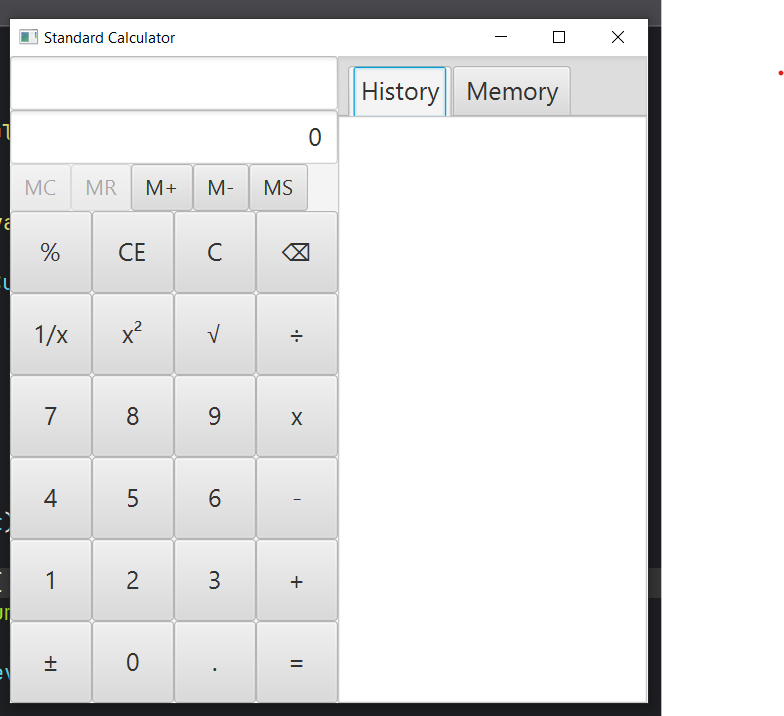
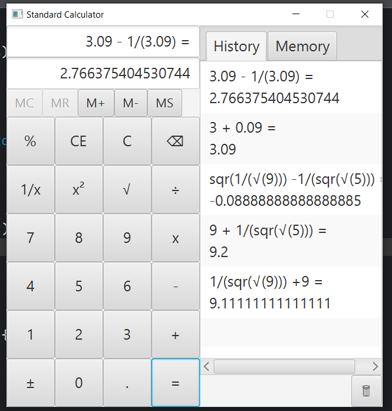

# Standard Calculator



> A desktop calculator application built with JavaFX. This project started as a single-class implementation and was later refactored into a layered architecture using Model, Service, and UI classes to improve maintainability and code organization.

## Features

### Standard Operations

* Addition (+)
* Subtraction (-)
* Multiplication (×)
* Division (÷)
* Percentage (%)

### Scientific Operations

* Square Root (√)
* Square (x²)
* Reciprocal (1/x)
* Sign Toggle (±)

### Additional Features

* Calculation History
* Memory Functions

  * MS (Memory Store)
  * MR (Memory Recall)
  * MC (Memory Clear)
  * M+
  * M-
* Backspace
* Clear (C)
* Clear Entry (CE)
* Keyboard Support

## Project Evolution

### Version 1

Single-class implementation (`Standard_Calculator.java`)

* All UI, logic, and state management were handled in one class.
* Used to understand JavaFX event handling and calculator logic.

### Version 2

Refactored into layered architecture.

```text
src/
└── mvcVersion/
    ├── CalculatorMain.java
    ├── CalculatorUI.java
    ├── CalculatorService.java
    └── CalculatorModel.java
```

#### Responsibilities

**CalculatorUI**

* Handles JavaFX components
* Manages user interactions
* Updates displays

**CalculatorService**

* Contains calculator business logic
* Performs calculations
* Processes user input

**CalculatorModel**

* Stores calculator state
* Holds calculation data

**CalculatorMain**

* Creates and connects all layers
* Starts the JavaFX application

## Screenshot



## Technologies Used

* Java
* JavaFX
* Eclipse IDE
* Git
* GitHub

## Learning Objectives

This project was built to practice:

* Object-Oriented Programming (OOP)
* JavaFX UI Development
* Event Handling
* MVC / Layered Architecture
* Refactoring
* Git & GitHub Workflow

## Future Improvements

* Complete JUnit Test Coverage
* Enhanced Scientific Calculator Features
* Better Error Handling
* Theme Support
* Improved Memory Management

## Author

Aung Myo

GitHub: https://github.com/aungmyo-learner
